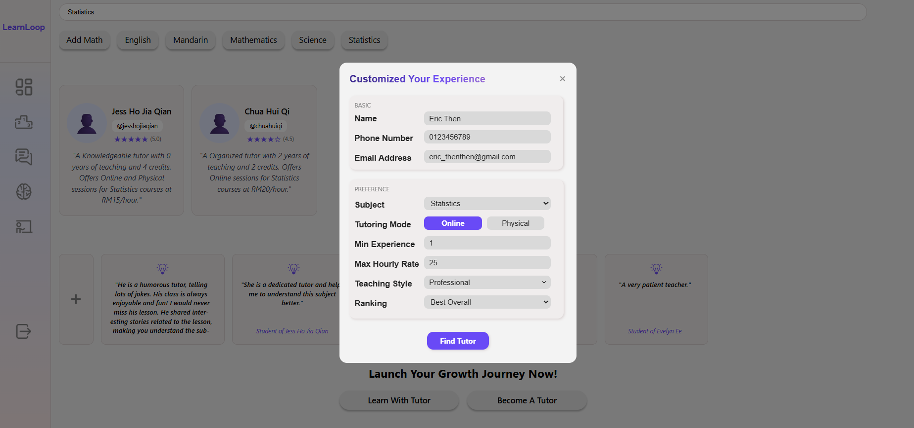

# LearnLoop User Guide

## What is LearnLoop?
LearnLoop is an online application designed to support both students and tutors, enhancing the overall learning and teaching experience. Unlike existing tutoring platforms in Malaysia, LearnLoop offers a more inspiring set of interconnected features. In addition, it fosters a sustainable ecosystem that provides long-term value for users, ensuring continuous learning opportunities for everyone.

<ul>
  <li><a href="#key-features">Key Features</a></li>
  <li><a href="#log-in-as-guest">Log in as Guest</a></li>
  <li><a href="#sign-up-an-account">Sign up an Account</a></li>
  <li><a href="#log-in-to-learnloop">Log in to LearnLoop</a>
    <ul>
      <li><a href="#sidebar">Sidebar</a></li>
    </ul>
  </li>
  <li><a href="#smart-learning">Smart Learning</a>
    <ul>
      <li><a href="#ai-chatbox">AI Chatbox</a></li>
      <li><a href="#mock-test">Mock Test</a></li>
      <li><a href="#flashcards">Flashcards</a></li>
      <li><a href="#pomodoro-timer">Pomodoro Timer</a></li>
    </ul>
  </li>
  <li><a href="#past-performance-dashboard">Past Performance Dashboard</a>
    <ul>
      <li><a href="#functions-in-past-performance-dashboard">Functions in Past Performance Dashboard</a></li>
      <li><a href="#predictive-decision-tree-model">Predictive Decision Tree Model</a></li>
    </ul>
  </li>
  <li><a href="#forum">Forum</a>
    <ul>
      <li><a href="#Create-a-Post">Create a Post</a></li>
      <li><a href="#Comment-a-Post">Comment a Post</a></li>
      <li><a href="#Like-a-Post">Like a Post</a></li>
      <li><a href="#Like-a-Comment">Like a Comment</a></li>
    </ul>
  </li>
  <li><a href="#leaderboard">Leaderboard</a></li>
  <li><a href="#guided-learning">Guided Learning</a>
    <ul>
      <li><a href="#subject-filtering">Subject Filtering</a></li>
      <li><a href="#tutor-feedback">Tutor Feedback</a></li>
      <li><a href="#find-tutor">Find a Tutor</a></li>
      <li><a href="#become-tutor">Become a Tutor</a></li>
    </ul>
  </li>
  <li><a href="#known-issues">Known Issues</a></li>
  <li><a href="#troubleshooting">Troubleshooting</a></li>
  <li><a href="#privacy-and-data-protection-notice">Privacy and Data Protection Notice</a></li>
  <li><a href="#disclaimer">Disclaimer</a></li>
</ul>

## 🧩 Key Features
- **[Forum](#forum)**: Communication platform between **tutors** and **students**.
  - Tutors gain exposure via answering questions to get credits.
  - Students receive answers and basic guidances.
  - Students give an upvote for useful comments.

- **[Leaderboard](#leaderboard)**: Ranking platform to showcase high quality **tutors**.
  - Tutors will be ranked according to number of upvotes from students.
  - Students can recognize tutors with high credibility.
 
- **[Guided Learning](#guided-learning)**: Tutor selection platform for **students**.
    - Students can select their tutors by using the dedicated filtering system according to subject, teaching style and ranking options.
    - Stdents can submit feedbacks of tutors to enhance the filtering system.
 
- **[Smart Learning](#smart-learning)**: Virtual AI tutoring platform for **students**.
  - Students can get subject material guidance through the AI chatbox.
  - Students can have their instant mock tests via the Mock Test Generator for self-reflection.
  - Students can get automatically generated flashcards to revise weak topics from the mock tests.
  - Students can use the Pomodoro Timer to track their study hours for each subject.
 
- **[Past Performance Dashboard](#past-performance-dashboard)**: Visualization platform that displays **students**' academic progress and performance statistics.
    - Students can identify their best and worst subjects, along with total study hours and average mock test accuracy to inform study performance.
    - Students can forecast the probability final grade of selected subject by Decision Tree model.

## 👤 Log in as Guest
- Access LearnLoop [here](https://learnyloopy-jesshohohohos-projects.vercel.app/auth), then click `Continue as Guest` on the page — no email, username, or password required.

- Guests will be redirected to the [Guided Learning](#guided-learning) page. They can only access the contents in [Guided Learning](#guided-learning), [Forum](#forum), and [Leaderboard](#leaderboard).

 ## 🆕 Sign up an account
- Sign up for LearnLoop [here](https://learnyloopy-jesshohohohos-projects.vercel.app/auth), by entering your email, and creating a username and password.

- Confirm your sign up by verifying the email sent to your inbox.

- After verification, you will be signed in and redirected to the the main page.

## 🔑 Log In to LearnLoop
Once logged in, you will be redirected to the main page, which features the [Past Performance Dashboard](#past-performance-dashboard) and a [sidebar](#sidebar) for navigating to other features of LearnLoop. If you are a first-time user, the dashboard will display everything as blank. Kickstart your learning using our [Smart Learning](#smart-learning) platform to get a summary of your study performance.

### ***📚 Sidebar*** 

The sidebar is always displayed on the left side of every page, allowing users to navigate to any page at any time. The table below provides explanations for each button in the sidebar.

<table align="center">
  <tr>
    <td></td>
    <td><b>Past Performance Dashboard</b> Displays students' academic statistics and progress through clear visual summaries.</td>
  </tr>
  <tr>
    <td></td>
    <td><b>Leaderboard</b> Highlights top-performing tutors based on their achievements and activity.</td>
  </tr>
  <tr>
    <td></td>
    <td><b>Forum</b> Provides a communication platform where tutors and students share questions, resources, and ideas.</td>
  </tr>
  <tr>
    <td></td>
    <td><b>Smart Learning</b> Offers virtual tutoring support with study material guidance, mock tests, flashcards, and a pomodoro timer.</td>
  </tr>
  <tr>
    <td></td>
    <td><b>Guided Learning</b> Enables students to select their preferred tutors through a dedicated filtering system.</td>
  </tr>
  <tr>
    <td></td>
    <td><b>Exit</b> Allows users to securely log out and end their session.</td>
  </tr>
</table>

## 🧠 Smart Learning

Smart learning is a virtual tutor platform to provide incentive revision based on the uploaded study materials. To use this feature, it is crucial to provide your own study materials in specified format (.pdf, .txt or .docx). The intention of doing so is to give specific and reliable outcome from the LLM for revision purposes. The performance in mock test and study time will be stored and visualized in the [Past Performance Dashboard](#past-performance-dashboard).

To access this feature, click the icon below in the sidebar.

<table>
  <tr>
    <td></td>
    <td><b>Smart Learning Icon</b> </td>
  </tr>
</table>

You will be redirected to the front page of **Smart Learning** platform as shown below. 

Next, click the upload icon as shown in the bottom right of the **Pick a subject** section. 

<table>
  <tr>
    <td></td>
    <td><b>Upload Icon</b> Click this icon to reach the upload material page.</td>
  </tr>
</table>

When you reach the upload material window, you can insert your subject name and browse your study material from your device. Click `Submit` to finalize your uploaded material.

If your material is uploaded successfully, it will be displayed in the **Pick a subject** section.

Now, your journey to use the features in **Smart Learning** begins! 

### ***💡 AI Chatbox***

- **Select a subject** you wish to revise by clicking the `Subject` button. The button will turn purple once you click it. 
  - The system will use **LLM-RAG** (Large Language Model with Retrieval-Augmented Generation) to provide subject-based guidance and materials.  
  - If your question is **beyond the scope of LLM-RAG**, the chatbox will automatically switch to a **classical LLM** to generate an appropriate response.  

- You may also choose **not to select a subject** before asking questions.  
  - In this case, the AI chatbox will rely **solely on the classical LLM** to answer your queries.  

### ***📝 Mock Test***
Follow these steps to generate a set of questions in preparation for your upcoming examinations.
- Click the `Subject` you wish to have mock test. The button will turn purple once you click it.
- Click the `Mock Test/Quiz` to open a pop-up window.
- Click the `Start Test` as shown in the pop-up window.

Begin your mock test journey!

Once you finish answering the questions, the results will be shown and stored in the [Past Performance Dashboard](#past-performance-dashboard). Click the `Test Again` if you wish to retake the mock test. Click the `Close` button if you wish to redirect to [Smart Learning](#smart-learning) page.

### ***🗂️ Flashcards***

Suppose if you make mistakes in the mock test, the questions will be stored and shown in the form of flashcards.

- Click the flashcard or press the `Spacebar` on your keyboard to flip the flashcards to get the answers.

- Rate your understanding `(Again / Hard / Good / Easy)` by clicking a button or using the number keys `(1–4)`. The flashcards will be reordered based on your ratings for the next review.
- Click the `Close` button or press `Esc` to redirect to [Smart Learning](#smart-learning) Page.

### ***🍅 Pomodoro Timer***

Suppose if you want to trace your study time, pomodoro timer will be your choice! It serves to record your study time, and remind you to take a rest. Click the button as shown below to be redirected to the Pomodoro Timer.

<table>
  <tr>
    <td></td>
    <td><b>Pomodoro Icon</b> </td>
  </tr>
</table>

- Choose the subject you wish to revise from the dropdown menu.

- Press `Start 25-Minute Study Session`.
- Refer to the list of buttons as shown at table below for Pomodoro Timer.

<table>
      <tr>
    <td></td>
    <td><b>Minimize the pomodoro tab</b> </td>
  </tr>
  <tr>
    <td></td>
    <td><b>Redirect completely to Smart Learning Page</b> </td>
  </tr>
</table>

**NOTE: After minimizing the Pomodoro Timer, you can continue accessing other functions in Smart Learning, but page navigation will be disabled.**

After 25 minutes, a 5-minute rest period will begin.

After the rest period ends, a congratulatory window will appear, and 0.5 hour will be recorded in the [Past Performance Dashboard](#past-performance-dashboard).

## 📋 Past Performance Dashboard

The summary of your performance from the **[Smart Learning Platform](#smart-learning)** is displayed on this Past Performance Dashboard page. The key function of this dashboard is a predictive decision tree model, which allows students to input their test and assignment scores along with data from the **[Smart Learning Platform](#smart-learning)** to predict the probability of achieving their desired grade in a subject.

To reach out this feature, click the icon of Past Performance Dashboard as shown in the sidebar. 

<table>
  <tr>
    <td></td>
    <td><b>Past Performance Dashboard Icon</b> </td>
  </tr>
</table>

< image here >

- The component above displays the summary of your study performance which are:
  - Best Subject
  - Worst Subject
  - Average Total Study Hour
  - Average Accuracy of Mock Test

- The component in the middle visualizes bar charts displaying the Test 1, Test 2, and Assignment scores (self-inserted), as well as the Mock Test and Study Hours (from the Smart Learning Platform).

The component below displays information similar to that shown above. The action buttons in the rightmost column allow users to edit self-inserted values, delete entries, or navigate to the predictive decision tree model.

### ***🔧 Functions in Past Performance Dashboard***

<table style="border-collapse: collapse; width: 100%;">
  <tr>
    <td style="background-color: #0078D7; color: white; font-weight: bold; text-align: center; padding: 8px 16px; border-radius: 6px; width: 120px;">
      Edit
    </td>
    <td><b>Insert the scores for Test 1, Test 2, and Assignments.</b></td>
  </tr>
  <tr>
    <td style="background-color: #E81123; color: white; font-weight: bold; text-align: center; padding: 8px 16px; border-radius: 6px;">
      Delete
    </td>
    <td><b>Reset all study summaries for the selected subject.</b></td>
  </tr>
  <tr>
    <td style="background-color: #107C10; color: white; font-weight: bold; text-align: center; padding: 8px 16px; border-radius: 6px;">
      Predict
    </td>
    <td><b>Open the predictive decision tree model.</b></td>
  </tr>
</table>

### ***🤖 Predictive Decision Tree Model***

- Click the **Predict** button to open a **popup window** that displays the model interface.

< image here >

- Select the desired grade from the dropdown menu.
- Click the *Predict Probability* button to generate the result, then return to the Past Performance Dashboard by clicking the *Close* button.

## 📚 Forum

Forum is a communication platform for both students and tutors to ask and answer questions. It is mutually beneficial: students can have their questions answered, while tutors earn credits when their answers are liked by users.

To access this feature, click the icon below in the sidebar.

<table>
  <tr>
    <td></td>
    <td><b>Forum Icon</b> </td>
  </tr>
</table>

Users can search for posts using the filter bar at the top, and view trending topics in the top-right corner.

### ***🖊️ Create a Post***

- Click the `+` button at the top-right of the interface.

- Enter the subject and question in the popup window.  
- Submit your question by clicking the `Post Question` button. Your question will now be displayed in the forum.

### ***👍 Like a Post***

- To like or see how many likes, refer to the table below:

<table>
  <tr>
    <td></td>
    <td><b>Like Button</b> Located at the bottom-right of each comment.</td>
  </tr>
</table>

### ***💬 Comment a Post***

- To comment a post, click the entire cell of the post, and it will be redirected to the comment section. The number of comments are shown beside the comment icon.

<table>
  <tr>
    <td></td>
    <td><b>Comment Icon</b> Located at the bottom-right of each comment.</td>
  </tr>
</table>

- Write your comment in the white cell.

  
- Click `Post Comment` to submit your comment.

- Return to the main **Forum** page by clicking the `return` button as shown below.

<table>
  <tr>
    <td></td>
    <td><b>Return Icon</b> Located at the top-left of comment section.</td>
  </tr>
</table>

### ***❤️ Like a Comment***

- To like a comment on a post, follow a similar method to navigate to the comment section as shown in ***[Comment a Post](#comment-a-post)***.  
- Click the `like` button located at the right of each comment.
- Return to the main **Forum** page by clicking the `return` button as shown below.

<table>
  <tr>
    <td></td>
    <td><b>Return Icon</b> Located at the top-left of comment section.</td>
  </tr>
</table>

## 🏆 Leaderboard

Each like in the comment section of a post in the **[Forum](#forum)** is converted into an equal number of credits. Tutors with high interaction levels with students are displayed on the leaderboard as recognition for their contributions. This system encourages tutors to engage with students, fosters a sustainable learning ecosystem, and increases exposure and popularity for active tutors.

To access this feature, click the icon below in the sidebar.

<table>
  <tr>
    <td></td>
    <td><b>Leaderboard Icon</b> </td>
  </tr>
</table>

- The leaderboard contains the following information:  
  - Rank  
  - Tutor's name  
  - Number of credits  
  - Styles (classified by LLM in [Guided Learning](#guided-learning))  
  - Rating (average rating from students)

- To refresh the page, refer to the `refresh` button located at the top-right of the interface.

## 👨‍🏫 Guided Learning

Guided Learning is the platform where students can select tutors using a dedicated filtering system and submit feedback to generate tutors’ styles and ratings. Additionally, tutor registration is managed through this interface.

To access this feature, click the icon below in the sidebar.

<table>
  <tr>
    <td></td>
    <td><b>Guided Learning</b> </td>
  </tr>
</table>

- The **Guided Learning** page contains the following information:
  - Subject filtering bar.
  - Tutors' name, teaching subject, teaching experience, hourly rate and number of credits.
  - Students' feedback.
  - [Find a tutor](#find-tutor) button to select desired tutor.
  - [Become a Tutor](#become-tutor) button to submit tutor application.

### ***🔍 Subject Filtering***

- Users can filter tutors by selecting their preferred subject from the filtering bar at the top or by clicking the subject buttons.

- The list of tutors will then be narrowed down based on the selected subjects.

### ***⭐ Tutor Feedback***

- Click the `+` button under the section of ***Trusted by Thousands — Hear from Our Alumni***
- Fill in the dropout cells, choose your rating score and leave a comment in the popout window.

- Click `Submit Review`.

### ***🕵️ Find a Tutor***

- Click the `Learn With Tutor` button located at the middle-bottom.
- Fill in your personal information and preferences at the popup window.

- Click `Find Tutor` to search for tutors.

- Select your preferred tutor by clicking `Contact Tutor`.

### ***🧑‍🏫 Become a Tutor***

- Click the `Become A Tutor` button located at the middle-bottom.
- Fill in your basic and detail information at the popup window.

- Click `Submit Application` to submit your application form.

## 🪫 Known Issues

- The LLM-RAG in [Smart Learning Platform](#smart-learning) has limited processing capacity, with restrictions on requests and tokens per minute and per day, therefore users are advised to upload smaller documents (below 5000 words each) in multiple batches.

- The function that enables students to access tutors’ contact information in [Guided Learning](#guided-learning) after a tutoring arrangement is made is not yet implemented. This remains a development limitation to be addressed in future updates.

## 🛠️ Troubleshooting

| **Issue** | **Solution** |
|------------|--------------|
| Users may encounter the error message ***"Not authenticated"*** when accessing specific features, despite being logged in. | Logging out and logging back in usually resolves this issue. |

## 🛡️ Privacy and Data Protection Notice

### ***Purpose***
This notice explains how LearnLoop collects, uses, and shares personal information of Students and Tutors in connection with its tutoring services.

### ***For Students***
- Students acknowledge that their personal information will be shared with Tutors once they select a Tutor.  
- Students acknowledge that their personal information will be securely stored by LearnLoop.

### ***For Tutors***
- Tutors acknowledge that their personal information, such as full name, teaching experience, and hourly rates, will be publicly displayed.  
- Tutors acknowledge that their contact information, such as email and phone number, will be shared with Students once a tutoring arrangement is made.

### ***Responsibilities of LearnLoop***
- LearnLoop is responsible for securely storing all personal information under its care.  
- LearnLoop will not use personal information for any purpose other than those explicitly mentioned in this notice.  
- LearnLoop complies with applicable data protection regulations.

## 📢 Disclaimer

### ***Purpose***
This Disclaimer sets out the limits of responsibility and liability of LearnLoop in relation to the services and features provided through the platform.  

LearnLoop is a prototype educational platform developed **solely for the CodeNection 2025 competition**. It is not a commercial product and is intended only for demonstration and evaluation purposes.

### ***General Notice***  
- By using LearnLoop, Students and Tutors acknowledge and agree that the platform is an experimental prototype built for the CodeNection 2025.  
- LearnLoop incorporates artificial intelligence (AI), predictive models, and automated systems which may not always produce accurate, consistent, or reliable results.  
- LearnLoop makes no representation, warranty, or guarantee regarding the accuracy, completeness, performance, or reliability of such outputs.

### ***For Students***
- LearnLoop does not guarantee the accuracy of any predictive results displayed in the **[Past Performance Dashboard](#past-performance-dashboard)** and AI contents created in **[Smart Learning](#smart-learning)**.  
- Any grade prediction or performance forecast generated by the system is for **informational and self-reflective purposes only** and should not be relied upon as an exact or guaranteed outcome.  
- LearnLoop shall not be held responsible for any decision or action taken by Students based on these predictive results.  
- LearnLoop shall not be responsible for any loss, damage, or issue arising from Students voluntarily disclosing their personal information (including but not limited to bank account details or passwords) to Tutors.  
- LearnLoop is not responsible for any private communication, transaction, or relationship established directly between Students and Tutors outside the platform.

### ***For Tutors***
- LearnLoop does not guarantee the accuracy of any AI-based style classification, rating, or descriptive label generated for Tutors. These are automatically produced based on system data and are provided solely for indicative purposes.  
- LearnLoop shall not be held responsible for any error, misrepresentation, or perceived inaccuracy arising from such AI-generated classifications.  
- LearnLoop shall not be responsible for any loss, damage, or issue arising from Tutors voluntarily disclosing their personal information (including but not limited to bank account details or passwords) to Students.  
- LearnLoop is not responsible for any private communication, transaction, or relationship established directly between Tutors and Students outside the platform.

### ***Limitation of Liability*** 
- LearnLoop, to the fullest extent permitted by law, disclaims all liability for any direct, indirect, incidental, or consequential loss or damage arising from the use or inability to use the platform, including any reliance on AI-generated or predictive outputs.  
- Nothing in this Disclaimer limits any statutory rights or obligations that cannot be excluded under applicable Malaysian law.  
- If any provision of this Disclaimer is found to be invalid or unenforceable, the remaining provisions shall continue in full force and effect.

### ***Competition Context***
- This platform was created as part of the CodeNection 2025 competition to showcase innovative use of AI and Machine Learning (ML) models in application development.
- All functionalities, including predictive dashboards and AI-generated content, are provided for demonstration purposes only and may not reflect final or commercial-grade performance.
- If any provision of this Disclaimer is found to be invalid or unenforceable, the remaining provisions shall continue in full force and effect.

### ***Acknowledgment*** 
By accessing or using LearnLoop, Students and Tutors acknowledge that they understand and accept the inherent limitations of predictive and AI-generated information, and agree that LearnLoop cannot be held responsible for any inaccuracies or outcomes resulting from such automated systems.

